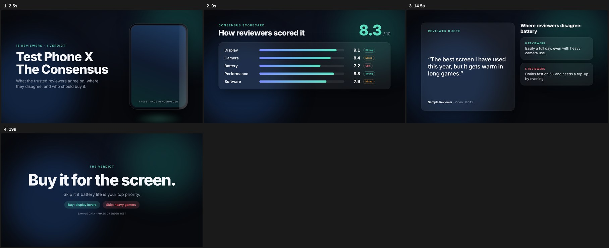

# Production playbook

The one reference doc for this repo. `CLAUDE.md` holds the short rules every session must follow; this file holds
everything else: the full specs, how-tos, measurements and the lessons behind each rule. Every rule says **why**, so a
future session can tell when a rule applies and when it doesn't.

It replaces `HANDOFF.md`, `docs/documentary-playbook.md`, `docs/documentary-production.md`, `docs/fetch-video.md` and
`docs/phase0-report.md` (merged here in Oct 2026). Per-project READMEs and briefs stay next to their projects as records.

**Contents**
- Part A: How we work. 1 Owner and delivery · 2 Claude models · 3 Parallel sessions · 4 Quality first
- Part B: Documentaries. 5 The look · 6 Workflow and engines · 7 Script and voice · 8 Media sourcing ·
  9 Realistic animation · 10 HyperFrames · 11 Sound · 12 Facts, honesty and rights · 13 Render and deliver ·
  14 Pre-render review · 15 Lessons log
- Part C: Phone consensus pipeline. 16 Product and spec · 17 Claude in the pipeline · 18 Architecture and stages ·
  19 Control flow, secrets, evals · 20 Build phases · 21 Phase 0 measurements
- Part D: 22 Recommendations

---

# Part A: How we work

## 1. Owner and delivery

- **Kishore works only from an Android phone** (GitHub app, Termux, SSH to a VPS, the Claude app). No PC.
  *Why:* every step must run in a cloud session, GitHub Actions or the VPS, and every result must be viewable on a phone.
- **Deliverables a phone can open:** a Gofile link for the MP4 (1080p ≈ 200–330 MB, 4K ≈ 1 GB), a contact sheet PNG/JPG,
  the SRT and the YouTube description, sent with `SendUserFile` (30 MB cap per file). Report in plain words: what changed,
  what is still a stand-in, any rights or Content ID risk.
- **Git:** all work lands on `main`. *Why:* in Oct 2026 nine stale session branches hid finished work; one branch keeps
  everything findable. Parallel sessions (§3) each push to their own branch and folder, and the coordinator merges them
  into `main` the same day, then deletes the branch.
- **Once the owner approves a cut, stop editing it.** Deliver exactly that cut (upscale, captions), nothing more.
  *Why:* on breath-hold, slipping in further edits after approval cost a review round.
- English first; keep all script and on-screen text i18n-ready (Telugu is already in use for the documentaries).

## 2. Claude models: what they can do and where we use them

Facts from the Claude API reference bundled with Claude Code (cached 2026-10-06). Re-check with the Models API
(`client.models.retrieve(id)`) before relying on a number; prices and limits change.

| Model | ID | Context / max output | Price in / out per MTok | Best at (for us) |
|---|---|---|---|---|
| **Claude Opus 5.5** (default) | `claude-opus-5-5` | 1M / 128K (300K on Batch, beta) | $4 / $20 · cache read $0.20 · batch −50% | Everything that matters: research synthesis, fact-check, script, HyperFrames code, visual QA |
| Claude Fable 5.1 (most capable) | `claude-fable-5-1` | 1M / 128K | $10 / $50 · cache read $0.25 | Hardest reasoning and long autonomous work. Use only when the owner asks; 2.5× Opus price |
| Claude Sonnet 5.5 | `claude-sonnet-5-5` | 1M / 128K | $2 / $10 | High-volume work where Opus quality isn't needed. **Not used by default** |
| Claude Haiku 5.5 | `claude-haiku-5-5` | 1M / 128K | $0.10 / $0.50 (≤100K prompt) | Cheap bulk classification. **Not used by default** |

**What Opus 5.5 is good at, and how we use it**
- **Reads images precisely.** Even at `low` effort it reads charts, diagrams and screenshots more accurately than Opus 5
  did at its highest. Dense or technical images still gain from higher resolution and from letting it crop and zoom with
  PIL/OpenCV in a container. *Use:* contact-sheet review of every asset, frame QA of renders, checking that on-screen data
  matches the VO (the 168/90 monitor mistake, §15).
- **Doesn't invent sources.** Much less likely to state a figure or cite a source the inputs don't support; more
  detail-oriented on large inputs (a date on the wrong weekday, a chart that doesn't match the figures). *Use:* fact-check
  pass on every script, at `max` effort.
- **Agentic coding.** At its default `medium` effort it matched Opus 5's `high` on multistep repo work with half the tokens.
  *Use:* writing HyperFrames compositions, engines and assembly code; render → snapshot → look → fix loops.
- **1M context.** All transcripts, articles and the script fit in one call: cross-source synthesis without chunking.
- **Design defaults.** Asked for visuals with no direction, it falls back on a few stock styles, and "avoid a generic
  look" just swaps one default for another. **Name the specific patterns to avoid** (§5 lists ours), look at the first
  result, and extend the list.
- **Limits.** Input is text and images only: no video or audio. Video is checked through extracted frames and contact
  sheets; audio through transcripts, `silencedetect` and `volumedetect`. Knowledge stops at June 2026, so every fact comes
  from collected sources.

**API rules** (enforced in `pipeline/llm.py`; details in `CLAUDE.md`): thinking is always on and can't be disabled;
set depth with `output_config.effort` (API default is `medium`, so always set it); forced `tool_choice` returns a 400,
so get JSON with `output_config.format`; read only `text` blocks; check `stop_reason` for `refusal`/`max_tokens`;
stream big requests; cache the shared prefix in `system` with a 1h TTL; enable the server-side refusal fallback.

## 3. Parallel sessions: finishing faster without cutting quality

**Facts (Oct 2026; sources: code.claude.com/docs/en/cloud-environments, /claude-code-on-the-web, /sub-agents, plus
measurements in a session):**
- **Each cloud session is its own VM:** about 4 vCPU, 16 GB RAM and 30 GB disk. N sessions = N× CPU for rendering.
- **Subagents** (the Agent tool inside one session) share that session's VM and CPU (up to 20 at once). They speed up
  waiting work (web research, fact-checks, reading contact sheets), not CPU work.
- **No documented cap** on concurrent cloud sessions, but all sessions **share the account's usage limits**: 6 sessions
  burn usage about 6× faster. No separate compute charge.
- **All sessions share the same outbound IP range** (Anthropic's proxy). Rate limits (Wikimedia 429, YouTube bot checks)
  hit every session at once, so **parallel sessions don't speed up media downloads**; they make 429s worse.
- **Idle VMs pause after a few minutes and can be reclaimed**, losing running jobs. Watch long renders with Monitor so the
  session stays active; start them with `nohup`.
- The GitHub proxy rejects **branch deletions and tag pushes** from sessions (the owner deletes branches in the browser).
- A coordinator session can start and steer others with the `create_session` / `send_message` / `get_session` /
  `list_events` / `archive_session` tools.

**Plan for one 10-minute documentary** (expected wall clock ~1–1.5 h instead of 3–4 h):
| Session | Job | Output |
|---|---|---|
| S0 coordinator | Locks script, VO and EDL on `main`; splits the EDL into ~2.5-min blocks at dip-to-black points; pins encode settings (size, fps, codec, GOP, bitrate cap, audio format) so parts join without re-encoding; starts the others | `projects/<slug>/edl.csv`, `parts.json` |
| S1 sourcing (one only) | All downloads at a polite rate, contact sheets, `media_manifest.csv`; subagents for parallel searching on hosts that don't rate-limit | manifest, contact sheets, URL list |
| S2–S3 animation | One HyperFrames/Three.js scene folder each (`video/<project>/<scene>/`), native 4K render | scene MP4s |
| S4–S7 render shards | Each pulls assets, renders its EDL rows | `projects/<slug>/parts/N/part.mp4` |
| S0 final | Concat (`ffmpeg -f concat -c copy`), music bed and ducking over the full length (never per part, to avoid seams), pre-render review, delivery | master MP4, contact sheet, SRT |

**Rules:** each session owns one folder and one branch (no merge conflicts); same effort and quality in every shard; media
over 100 MB never goes in git (hand over by URL list and re-download, or a release asset/LFS after a test upload); archive
sessions when done; 6–8 sessions is the sensible maximum. A fresh VM re-runs `npm ci` and pip installs, so add a
SessionStart hook or environment setup script that caches them.

## 4. Quality first: never trim effort for speed

The owner's rule (Oct 2026): **accuracy and the best output matter more than speed.**
- Run Claude at full strength: `high` or `xhigh` effort for building, `max` for fact-checks and final reviews. Never lower
  effort, skip a QA round, drop a fact-check or shrink research to finish sooner. *Why:* a wrong claim or a slide-like
  shot on a public channel costs more than an hour of compute.
- Get speed from **parallelism** (§3), caching and pre-rendering expensive layers, never from doing less.
- Research deeply: several independent sources per fact, the real event footage before stock, and a contact sheet of every
  asset before it goes into a cut.
- Fast mode stays off unless the owner asks (it costs 2× and only speeds up output tokens).

---

# Part B: Documentaries ("Be Practical with Kishore")

Applies to every narrated documentary or explainer (`projects/<slug>/`, `video/<project>/`, `episodes/<slug>/`).
The phone-review content rules (Part C) don't apply here.

**Role:** executive documentary director and motion-graphics engineer, at the standard of Vox, MagnatesMedia, Polymatter,
ColdFusion and Think Deep. **Goal:** turn a voiceover and a factual script into a cinematic, motion-heavy film. It must
look like a broadcast documentary or investigative film, **never a slide deck, corporate presentation or photo slideshow**.

## 5. The look

### 5.1 Zero-tolerance rules (and why)
1. **No presentation cards:** no full-screen text boxes, bullet lists, icon cards, summary slides or question-mark graphics
   on flat backgrounds. *Why:* breath-hold v1 was exactly that, and the owner's verdict was "a boring PowerPoint".
2. **No static canvas:** a motionless photo or flat colour never stays over **1.5 s**; a plain CSS gradient never counts as
   a background. The canvas always has camera motion, particle atmosphere or live video.
3. **85% real motion:** at least 85% of the runtime is moving video, screen recordings, kinetic data animation or B-roll.
   Stills are for authentic archival evidence only, and always animated (§5.4).
4. **Text ≤ 15% of the screen**, only as 2–4-word lower-thirds, locations/dates/telemetry, counters, timers and meters, or a
   one-line credit. Never paragraphs or lists.
5. **Cut, transition or pan every 2.5–4 s.** *Why:* retention; long holds read as a slideshow. Exceptions: LIVE clips and
   HyperFrames explainer scenes.
6. **Semantic lock:** every shot shows exactly what the VO says at that second (kidneys → renal animation, "CCTV
   isolation" → a high-angle surveillance view, "world record" → the actual attempt). *Why:* breath-hold showed a railway
   crowd for "the audience"; the owner rejected it. Generic B-roll only where the narration is generic.
7. **Real event footage beats stock**, and archive photos of the person from other years are a weak fallback. Hunt for the
   actual event first (§8).
8. **Avoid our known stock looks** (name them, per §2): floating glass cards, neon-on-black dashboards, centred title +
   subtitle on a gradient, icon grids, emoji, stock "scientist with test tube", generic space or lab filler.

### 5.2 Three layers in every frame
| Layer | Content | Rules |
|---|---|---|
| 1 Base (full screen) | Real footage, or a photo with continuous motion (Ken Burns 1.00→1.15 or a slow pan, parallax) | Never motionless |
| 2 Atmosphere | 35 mm grain, ~30% edge vignette, light leaks, optional 2.35:1 bars, low-opacity HUD/telemetry | Never hides the base |
| 3 Kinetic accents | Lower-thirds, counters, timers, callouts | Lower corners on a dark scrim, for readability on a phone |

### 5.3 Visual language by genre
Pick the genre before sourcing; it decides palette, media stack and accents.

| Genre | Palette | Media stack | Graphic accents |
|---|---|---|---|
| Science & medical | Deep navy, surgical teal, graphite | Electron-microscope loops, 3D anatomy, MRI/sonography, macro lab work, cell division | Focus callouts, animated yellow circles on the abnormality, telemetry grids |
| Biography & martial arts | Warm amber, chiaroscuro, 35 mm grain | Raw training footage, press conferences, archival newsreels, slow-motion performance, cultural demonstrations | Split screens, timecode counters, year stamps |
| Business & finance | Terminal charcoal, holographic chart sweeps | Trading floors, HQ aerials, currency printing, shipping lanes, factory automation | Isometric graphs, metric tickers, animated balance-sheet highlights |
| Tech, AI & digital | Matte black, electric cyan, neon phosphor | Data centres, circuit macros, browser UI mock-ups, terminals, wafer fabs | Terminal type, syntax highlights, network nodes |
| Philosophy, society & lifestyle | Desaturated monochrome with a saturated hero | Fast-motion crowds, commuter platforms, pupil macros, solitary landscapes | Pacing contrast: extreme speed, then sudden stillness |

### 5.4 Making stills move
When an authentic photo or document is irreplaceable:
1. **2.5D parallax:** cut the subject out (local model, `video/chipgamble/parallax.sh`); foreground scales toward 1.15×,
   background drifts to 0.95×.
2. **Atmosphere:** smoke, dust motes, light leaks or rain at ~15% opacity.
3. **Forensic magnifier:** on documents, scans or clippings, slide a magnifier or zoom circle over the exact line the VO
   reads; highlighter swipes on the exact words (`pdftotext -bbox`, as in the chip-gamble engine).
4. **Moving contact sheet:** 3–4 archival angles slide into a collage, one every ~1.5 s.

### 5.5 Owner's standing notes (from reviews; now rules)
1. Subject's **face and name within the first 15–20 s** (lower-third "NAME · born–died"); repeat the name lower-third when
   the VO says the name.
2. Stock or stand-in footage that could pass for the real event carries a permanent **"ILLUSTRATIVE FOOTAGE"** label
   (`+illus` in the EDL). Never give stock a CCTV/archival look; that look is for authentic footage only. Licensed stand-ins
   get honest tags ("ARCHIVE PHOTO · 2013", "B-ROLL").
3. **No on-screen data that contradicts the VO** (Prahlad v4 showed a monitor reading 168/90 under "vitals normal").
   Replace it with an honest, labelled graphic.
4. **No stock clip more than twice**; no filler space or lab footage. "When did what happen" gets a timeline graphic.
5. **Branding:** banner intro when the channel name is spoken (logo sting), small logo bug in a corner on every other shot,
   end on the logo end card with subscribe and YouTube end-screen zones. Files in `assets/brand/`.
6. **Science is explained with animation, never still plates** (§9). Label each "ILLUSTRATION", "ILLUSTRATIVE CURVE" or
   "HYPOTHESIS". *Why:* anatomy plates and microscopy stills were rejected on breath-hold.

## 6. Workflow and engines

Every video follows three steps, and each produces a file the owner can read on a phone:
1. **Asset manifest** (`asset-manifest.md` + `media_manifest.csv`): ID, file name, description, platform, exact search
   query, licence, credit, EDL slots. Before any code.
2. **EDL** (`edl.csv` / `edl.md`): timecode → asset → motion → overlay → text → sound and ducking cues → LIVE/VO_PAUSE rows.
3. **Assembly code** bound to the project's `assets/` folder; every scene's base layer is moving.

**Engines in the repo** (pick one per video; see §22 for the plan to unify them):
| Engine | Used for | Strengths |
|---|---|---|
| `video/chipgamble/engine.py` (HyperFrames, Python part specs) | The $10 Billion Chip Gamble | Scenes keyed to **spoken phrases** (`T("Enter Tata Electronics")`) resolved against word timestamps, so cuts land on words; 2.5D parallax, world map with routes, real documents with highlighter, data overlays, on-screen credits, `credits.py` |
| `projects/<slug>/assemble.py` (FFmpeg/Python, EDL CSV) | Prahlad Jani | Footage-led cuts; LIVE/VO_PAUSE breaks; per-shot cache (`out/tmp*/NNN.key`); `--check` for missing assets; HyperFrames inserts rendered separately |
| `video/doc/` (HyperFrames: `edl.mjs` → `make_registry.py` → `build.mjs`) | Breath-hold | Owner files in `assets/` win over stand-ins; canvas science animations (`_shared/anims.js`); live audio in sync |

Rebuild commands live with each project: `video/chipgamble/README.md`, `projects/prahlad-jani-drdo/README.md`,
`runs/breath-hold/README.md` and `assets/README.md` (owner footage drop-in for `video/doc/`). Part boundaries must sit on
beat edges; in `video/doc/` a pause beat (`{ pause: t, len }`) inserts silence, `single: true` keeps one continuous shot,
`mediaStart` sets the in-point, `live` + `liveGain` play the clip's own audio in sync.
Remotion and MoviePy are not installed; ask before adding them.

## 7. Script and voice

- **Never re-transcribe when a script exists.** Align scenes to script paragraphs and `silencedetect` timestamps, then word
  timings if needed. *Why:* Whisper on Telugu drops 20–30 s stretches and costs CPU hours; the script is already correct.
- **When no script exists (Telugu VO):** Whisper large-v3 (`turbo` is acceptable since the text is hand-corrected) on
  ≤ 9 s windows cut at pauses (`silencedetect -30dB d=0.25–0.3`), `language="te"`, `beam_size=5`,
  `condition_on_previous_text=False`, no VAD. Long or VAD-batched windows truncate, loop or output Kannada script.
  Consume the faster-whisper segment generator once (`list()`) before reading text and words. Write JSON after every chunk
  so a killed job can resume. Hand-correct into `phrases.*.tsv` / `sentences*.tsv`, then
  `projects/prahlad-jani-drdo/tools/align_phrases.py` for word-timed cues. CPU runs ~0.2× real time.
- **Voice:** the owner's recording preferred (helps YouTube's review of AI-heavy content); ElevenLabs VO in short blocks so
  retakes are cheap. Never synthesise a real person's voice or quote.
- **Subtitles:** `scripts/make_srt.py` (shifted by pauses); rebuild after any timing change. Telugu translations of LIVE
  clips go in the EDL `subtitle` column.

## 8. Media sourcing

<!-- filled from research: see below -->

## 9. Realistic animation

HyperFrames renders in headless Chrome with **SwiftShader (CPU) WebGL**, deterministically: everything must be a pure
function of time `t`. Today's 3D scenes (`video/prahlad/kidney3d`, `bladder3d`, `autophagy3d`; three 0.181.2) already use a
seeded RNG, `renderAt(t)` driven by `hf-seek` / `window.__hfThreeTime`, ACES tone mapping, physical materials and
RenderPass → UnrealBloom → OutputPass. Ranked upgrades (cost figures unverified unless marked; measure each on a 2 s shard
first):

1. **Real HDRI lighting instead of `RoomEnvironment`.** Biggest realism gain for almost no per-frame cost (PMREM is baked
   once). Poly Haven CC0 studio HDRIs at 1k–2k (reachable, HTTP 200). Keep the background a dark plate.
2. **Real models instead of procedural shapes.** Vendor `three/examples/jsm/loaders` (GLTF, RGBE/HDR, DRACO, KTX2; today
   `scripts/vendor-assets.mjs` copies only postprocessing, shaders, environments). Sources: BodyParts3D (CC BY-SA 2.1 JP) and
   Z-Anatomy (CC BY-SA 4.0) for anatomy; Smithsonian 3D (CC0 open access items); NASA 3D Resources; NIH 3D (licence per
   model). Sketchfab needs a token: download on the VPS. Convert to GLB, store under the scene's `assets/`, log the licence.
3. **PBR textures** (normal, roughness, AO) from ambientCG or Poly Haven (CC0): organic surfaces stop looking like plastic;
   texture lookups are cheap on a CPU renderer.
4. **One merged post-processing pass** with pmndrs `postprocessing` (bloom, vignette, noise, chromatic aberration, AgX tone
   mapping) and N8AO in its Performance preset at half resolution. Rough cost: grain/vignette/tone mapping ~5%, bloom
   15–30%, N8AO 30–60%, depth of field 30–80%.
5. **Grain and vignette in the FFmpeg assembly, not WebGL**, so 3D only pays for bloom and AO. Fake depth of field with a
   pre-blurred background plate.
6. **Cheap soft shadows:** one `PCFSoftShadowMap` light at 1024 or a baked contact-shadow texture; no VSM, no many-light
   shadows. Bake AO and lighting for static objects in Blender on the VPS.
7. **Organic motion from seeded noise as `f(t)`:** `simplex-noise` (MIT) with a seeded RNG (e.g. `mulberry32(42)`). Never
   step state from the previous frame: seeks jump and workers start mid-timeline.
8. **True 2.5D photo parallax:** depth map from Depth Anything V2 Small run offline (check its licence), then displace a
   subdivided plane in Three.js for a real camera dolly, filling the reveal with an inpainted or blurred plate. Better than
   the two-layer cutout in `video/chipgamble/parallax.sh`.
9. **Particles** (cells, blood, smoke) as InstancedMesh or Points positioned by seeded noise at `t`. Volumetric light as
   additive cone meshes with scrolled noise. GPU fluid sims are not seek-safe: use curl noise as a function of `t`, or
   pre-render the simulation to video.
10. **Clean diagrams:** GSAP + SVG (already in use). Lottie (`lottie-web`, MIT) works if driven by `goToAndStop(t*1000)`;
    a HyperFrames Lottie adapter is documented but untested here.

**Cost control (never by lowering quality):** pre-render each 3D insert once and composite it; native 4K only for hero
shots (others: 1080p render + Lanczos upscale, ~4× faster, unverified); `--quality draft` for review renders only;
`--workers 2–3` for WebGL (each worker is a Chrome with its own CPU renderer, within ~14 GB); limit transmission materials to
one or two hero objects (each re-renders the scene; ~30 min per 12 s); split long scenes into time-offset compositions and
render them in parallel sessions (§3), then `concat -c copy` with identical encoder settings.
Three.js gotchas: module script with an importmap to `./vendor/three/`, GSAP timeline in a separate classic script;
`preserveDrawingBuffer: true`, `setPixelRatio(1)`, size from `root.dataset.width`; bloom makes the canvas opaque, so draw
the background inside the scene.
Sources: hyperframes.heygen.com (runtimes-and-3d, cli, performance), github.com/N8python/n8ao, api.polyhaven.com,
ambientcg.com, dbarchive.biosciencedbc.jp (BodyParts3D), z-anatomy.com, 3d.nih.gov, 3d-api.si.edu, nasa3d.arc.nasa.gov.

## 10. HyperFrames (pinned `hyperframes@0.8.103`)

Rules are in `CLAUDE.md`. Gotchas we hit, each cost at least one render:
- `<video data-start>` inside a div with `data-start` fails `check` (StaticGuard). Video shots use an untimed wrapper
  (`data-vs`/`data-vd`) whose visibility the timeline toggles.
- The renderer paints video frames over sibling overlays in the same wrapper. Burn labels into clips with ffmpeg `drawtext`,
  or put overlays in a later layer.
- Never add tweens at negative positions: per-part timer keys from other parts inflated a 45 s part to 2477 s. Clip
  keyframes to `[0, dur]` per part.
- `tl.call` doesn't run on render seeks: use stacked elements and `tl.set`. No `letterSpacing` tweens.
- An SVG filter on a perfectly vertical or horizontal line renders nothing.
- `@font-face` goes in each `index.html` with root-relative paths; canvas fonts need a fallback (`Inter, Arial, sans-serif`)
  or the first frame renders in a serif.
- A `data-*` field named `src` collides with the scene "source footnote": use `img`.
- Canvas animations draw from a proxy tween's `onUpdate` using local time only (seeded RNG, pre-rendered sprites).
  `snapshot` may show a canvas at t=0; verify in Playwright by seeking and sampling pixels
  (set `window.__timelines = {}` before load).
- WebGL reads the 4K size from the root `data-width`.
- Large `filter: blur()` glows and `backdrop-filter` dominate software-GL capture time: pre-render them to an image or video.
- Lint wants scenes as sub-compositions (`data-composition-src`).
- Speed on the cloud's software GPU: ~8 s of wall time per second of 2D, ~50 s per second of 3D; 3D with transmission
  materials ≈ 30 min per 12 s.

## 11. Sound

- **The VO leads.** BGM at −18 to −22 dB under the VO (bed at −15 dB with sidechain ducking lands ~20 dB under), ducked by
  the VO **and** live clip audio, rising only in pauses. Loop music with crossfades (`long_bed`), never an audible restart.
- **The video is not locked to the VO length.** EDL break types:
  - **Diegetic cut:** when authentic footage appears, the VO stops and the asset's own sound plays for 2–6 s (a conch, a
    press statement, a monitor alarm, machinery), then the VO resumes after the peak.
  - **`LIVE`:** real speech (press conference, news report) plays with its own audio for as long as it needs, picture
    untouched, credited in a lower-third; never talk over real dialogue. Keep third-party excerpts short; never the whole clip.
  - **`VO_PAUSE`:** 2–4 s of real ambience. `vo_skip` drops a duplicated VO stretch after a break.
  Real archival audio (e.g. a CC BY clip on archive.org) beats an empty LIVE row.
- **Loudness:** two-pass **linear** normalisation to −14 LUFS integrated, −1 dBTP (one gain + limiter). *Why:* single-pass
  `loudnorm` pumped silent pauses up to narration level.
- `scripts/make_bed.py` synthesises a royalty-free bed (drones, pads, heartbeat, bowls); `scripts/final_mix.sh` mixes.

## 12. Facts, honesty and rights

- **Facts only from collected sources**, checked on the web before they go on screen. Where reports disagree (15 vs 16
  minutes), say "as reported" and note the other figure in the description. Present claims as claims; on health topics
  include the mainstream scientific view and at least one real skeptic beat.
- **Label unmeasured claims** (heart rate, "40–50% less oxygen") as narration claims or illustrations. Quotes verbatim only.
- **Safety lines** (e.g. "don't try breath-holding without training") in the description and on the end card.
- **Every asset logged** with its licence in `media_manifest.csv` (ID, URL, owner, licence, date, EDL slots);
  `projects/prahlad-jani-drdo/tools/credits.py` and `video/chipgamble/credits.py` turn manifests into description credits.
- **Third-party news/event footage:** short excerpts that we comment on, credited on screen; never the whole clip. The owner
  cleared event clips, photos, film names and trailer footage for breath-hold; ask again for each new subject. Warn about
  Content ID risk (fan reels carry added music).
- **AI generation only where no real asset exists**; AI shots never depict a real, identifiable person or pose as evidence;
  labelled "ILLUSTRATION" and logged in `credits.md`.
- Paid archives (AP Archive, Reuters) for anything long: ask the owner first, with the cost.

## 13. Render and deliver

- HyperFrames: `npx hyperframes lint` → `check` → `snapshot` → look at the PNGs → fix → render with `--workers 4`.
- **4K:** for a new film, render natively (`scripts/make_native_4k.mjs` + `render --workers 4`; `video/prahlad/render_4k.sh`).
  For an already-approved 1080p cut, upscale with ffmpeg (`scale=3840:2160:flags=lanczos` + mild `unsharp`, ≈0.23× real
  time). Never `--resolution 4k` (4× slower, §21).
- FFmpeg assembly at 4K: oversample Ken Burns 1.25× (2× is fine at 1080p); dip to black at block changes; lightly sharpen
  upscaled 288p archive footage; **bitrate-cap every encode** (temporal grain made a 3.4 GB 1080p file).
- Footage prep: vertical reels → crop the clean band above burned-in captions, Lanczos-upscale, check every crop on a contact
  sheet (one cut off the face). Tall portraits: pre-crop a 16:9 band at the top (`object-fit: cover` gave a headless torso).
  Letterboxed trailers: `cropdetect`, then scale. Keep audio only on LIVE/diegetic clips (`-an` for the rest). Pick in-points
  from 1 fps timecoded contact sheets.
- **Long jobs:** a backgrounded Bash command dies at its time limit (30 min default). Start renders with `nohup … &` and
  watch with Monitor. `assemble.py` caches every shot (`out/tmp*/NNN.key`), so re-runs only re-render changed rows; the key
  includes the script's mtime, so editing `assemble.py` invalidates the whole cache. One render at a time per session (~14 GB memory cgroup); kill stray loops first. If ffmpeg dies with
  an empty error, check `memory.failcnt`/`dmesg` for OOM.
- **Shell traps:** never `pkill -f <pattern>` in a command line that contains the pattern (it kills its own shell; use
  `[x]yz`). Never name a shell function after a command it calls (`cut(){ … | cut; }` forked ~1,500 shells and OOM-killed
  renders).
- **Deliver:** `scripts/upload_gofile.sh` once `gofile.io` and `*.gofile.io` are allowlisted in the environment's network
  settings; upload the master and a 720p copy. Commit sources, EDL, registry, transcripts, SRT and description; large
  footage stays out of git (`assets/video/*`, `assets/raw/`, `projects/*/assets/`, renders).

## 14. Pre-render review (every cut, before the final render)

Contact-sheet the cut and go shot by shot; write `review.md` (issue → shot IDs → fix). Have Opus look at the sheets at
`high` effort or above.
- [ ] ≥ 85% moving footage or animation; no unmoving still or flat frame over 1.5 s; no shot over 4 s except LIVE clips and
      HyperFrames scenes.
- [ ] Every shot matches the exact words over it; the VO is silent under every diegetic or LIVE moment.
- [ ] Face and name on screen within 20 s; name lower-third returns when the VO says the name.
- [ ] Every frame's on-screen data agrees with the VO (numbers, monitors, headlines, dates).
- [ ] Stand-ins labelled "ILLUSTRATIVE FOOTAGE"; authentic footage carries its source credit.
- [ ] No stock clip more than twice. Science beats animated and honestly labelled.
- [ ] Logo sting when the channel is named, logo bug elsewhere, end card last.
- [ ] No near-black or dead frames; block changes dip to black; the music bed never restarts audibly.
- [ ] Claims stay claims; a real skeptic or mainstream-science beat on health topics.
- [ ] About −14 LUFS; subtitles rebuilt after any timing change.

## 15. Lessons log

**Breath-hold (Vidyut Jammwal, Telugu, 7:17, v1→v5).** v1 was all text cards on gradients and was rejected as "a boring
PowerPoint". What fixed it: full-screen real media, cuts every ~3 s, real event reels (Instagram via yt-dlp), agency photo
galleries (6000 px), the official trailer, canvas science animations, short "watch this" clips with their own sound.
About a third of search results were wrong (Kathakali for Kalaripayattu, tulips for "eyes", a bomb-blast photo), hence the
contact-sheet rule.

**Prahlad Jani & DRDO (Telugu, 6:30, v1→v5).** Filled gaps with NASA lab B-roll, NASA ISS footage, Wellcome engravings
(tagged), Wellcome photos of Henry Tanner's 1880 fast, Coverr hospital footage. Couldn't source here: 2010 news footage and
press conference (paid archives), DRDO imagery, free photos of the subject (needs the VPS or a licence). Dailymotion search
found the 2010 ITN and Al Jazeera reports. A real 16 s CC BY clip of James Randi (archive.org, May 2010) became the skeptic
LIVE beat. v4 review produced the standing notes in §5.5. v5: logo sting and end card, HyperFrames timeline, vitals,
dehydration chart, metabolism dial, Three.js kidney, bladder (labelled hypothesis) and autophagy scenes, ILLUSTRATIVE labels,
stock repeats capped, face and name at 0:18, native 4K master (full 4K film ≈ 45 min).

**The $10 Billion Chip Gamble (English, 10:49).** Four HyperFrames parts timed word by word to the VO. Government photos and
PDFs from ism.gov.in; Commons films cut with `cuts.txt`. The phrase-keyed engine made cuts land on words without manual
timing; real documents with highlighter swipes carried the policy beats.

**Pixel 11 consensus review (v1→v2).** Review found: opinion counts presented as evidence, manufacturer figures shown as
measurements, bare counts without denominators, paused zeros on count-ups, different tests on one scale, quote cards
competing with captions, visual sameness. Fixes became rules in §16.

---

# Part C: Phone consensus review pipeline

## 16. Product and spec

**Premise:** "We analysed what 15+ trusted reviewers said about this phone, so you don't have to." An 8–12 minute 4K video.
What makes it different: a consensus scorecard per category (display, camera, battery, performance, software, build, value);
a "Where reviewers disagree" segment; "Problems reported by multiple reviewers"; who should buy, who should skip, better
alternatives at the same price; every claim traceable to reviewer + video/article + timestamp.

| Item | Spec |
|---|---|
| Resolution | 3840×2160, with a 1080p fast-preview mode |
| Frame rate | 30 fps (60 via config) |
| Codec | H.264 High, bitrate capped for YouTube 4K and the 2 GiB Release limit (§21) |
| Shorts | Optional 1080×1920 "verdict in 60 seconds" from the same data |
| Look | Dark, premium, cinematic: depth, light sweeps, parallax over official product images, kinetic type, animated charts |

**Hard rules (and why):** no AI images or video of the phone, no AI camera samples, no fake hands-on (misleads buyers and
breaks YouTube's synthetic-content rules); no footage from other creators (reviewers are credited by name and quoted in
on-screen text); press media only from `press_domains` in `config/sources.yaml`, logged in `media_manifest.json` and vetted
(right model and colour, no watermark, 4K-capable); AI abstract backgrounds allowed if logged.

**On-screen rules from the Pixel 11 v1 review:** a model badge on every scene that concerns a model; label every number as
`Google claims` / `Measured by <outlet>` / `Our editorial rating`; always show denominators ("11 of 15 outlets"); no element
ever shows a paused 0 (fade scores in at their final value); different tests never share a scale (each panel states its test
condition); camera samples shown full for ≥ 3 s, labelled `Model | lens/zoom | mode | Source`, never filtered; quote cards
only while the host says those words, placed in the upper area; vary layouts every 4–9 s; nothing over the host bar (bottom
220 px); no `filter: blur()`/`backdrop-filter`; text ≥ 30 px and ≤ 12 words per block.

## 17. Claude in the pipeline

Two modes: **API calls** from `pipeline/` (structured JSON, caching, batch pricing) and **Claude Code as an agent** in
GitHub Actions (`anthropics/claude-code-action@v1`, `--model claude-opus-5-5`; auth by `ANTHROPIC_API_KEY` or
`CLAUDE_CODE_OAUTH_TOKEN` for the owner's subscription; cap with `--max-turns`, `timeout-minutes`, `concurrency`).

Effort routing lives in `config/models.yaml`: source filter `low` (batch), claim extraction `medium` (batch), **synthesis
`xhigh`** (all sources in one 1M call; this is the product), **verify `max`** (fresh context; last defence against wrong
claims), script `high`, metadata `medium`, media vetting `medium`, composition `high`, visual QA `high`, thumbnail critique
`high`.

**Cost design:** cache the shared prefix (system + schema + source bundle) once with a 1h TTL so synthesis, verify and
script reuse it at $0.20/MTok; batch extraction (−50%); fast mode off; every run writes `cost.json`; budget
`per_video_usd` (default $15), stop and ask in the issue if a run would exceed it.

**Self-correcting loops:** research (synthesis → `max` verifier citing source + locator for every claim → re-synthesis,
max 2 rounds, then human); render (composition → lint/check → snapshot → Opus looks at the PNGs → fix, max 3 rounds,
verdicts saved to `qa/`); media vetting; thumbnail critique (3 variants ranked for mobile readability).

**Guardrails:** facts only from collected sources; fetched text is untrusted (`llm.untrusted()`); validate every output
against a schema, retry once, then fail the stage loudly.

## 18. Architecture and stages

```
Issue "Review: <phone>" → [1] DISCOVER (whitelisted channels/sites, low filter) → [2] COLLECT (yt-dlp subtitles with
runner → VPS → "unavailable" fallback; trafilatura articles; specs.json incl. INR price; press media + vision vetting)
→ [3] ANALYSE (batch extract → 1M xhigh synthesis → max verify → analysis.json/.md; wait for /approve research)
→ [4] SCRIPT (script.json: hook → specs → scorecard → categories → disagreements → common problems → buy/skip →
alternatives → verdict + credits; 3 titles, description with full credits, chapters, tags) → [5] VOICE (owner .m4a per
scene preferred, or TTS; timing from real audio) → [6] COMPOSE (agent + template library: hero-product, spec-grid,
scorecard, consensus-bar, quote-card, disagreement-split, issue-alert, buy-skip, alternatives, credits-roll; brand tokens)
→ [7] RENDER (1080p preview + QA loop; wait for /approve preview; 4K final via runner matrix + concat)
→ [8] PACKAGE (Release: final_4k.mp4, thumbnail 1280×720, youtube.json, credits.md, media_manifest.json, cost.json)
```
Each stage reads and writes `runs/<phone-slug>/`, is idempotent, writes `stage-N.log.md`, fails soft per source and loud
per stage. Extraction schema per source: `{category, aspect, sentiment -2..+2, quote, locator, reviewer}`. Synthesis per
category: score 0–10, agreement (strong/mixed/split), praised and criticised points with reviewer counts, disagreements,
problems from ≥ 2 independent sources, buy/skip, alternatives that sources mention.

## 19. Control flow, secrets, evals

- **Issues:** open "Review: <phone>" → bot comments progress → reply `/approve research` or `@claude <fix>` → watch the
  preview MP4 → `/approve preview` or feedback → Release link.
- **Secrets:** `ANTHROPIC_API_KEY`; optional `CLAUDE_CODE_OAUTH_TOKEN`; `YOUTUBE_API_KEY`; optional `TTS_API_KEY`;
  VPS runner / `VPS_SSH_KEY`; `YT_COOKIES` (for the fetch-video workflow, §8).
- **Evals:** `evals/` holds 3 released phones with hand-checked findings; CI reports claim precision, locator accuracy and
  score drift when `prompts/` or `config/models.yaml` change; changes merge only if evals don't get worse.

## 20. Build phases (stop and report after each)

0 Feasibility spike (done, §21) · 1 Research pipeline (stages 1–3) + issue flow + verifier loop · 2 Scene template library +
`/make-composition` + `/visual-qa` skills · 3 Script, voice, full 1080p preview · 4 4K final, thumbnail critique, packaging,
`cost.json` · 5 Evals, Shorts, Telugu i18n.

**Done (v1):** one issue produces a reviewed `analysis.md` and a QA-passed preview with no manual steps; two approvals
produce a 4K MP4, thumbnail and metadata as a Release; every claim traces to a locator and passed the `max` verifier; no
creator footage or AI product imagery; cost reported and under budget; all of it runnable from a phone.

## 21. Phase 0 measurements (2026-10-01, 4 vCPU / 16 GB, software GL)



| Variant | Workers | Wall time | × real time | Output |
|---|---|---|---|---|
| 1080p | 1 (auto) | 184 s | 9.2× | 6 MB |
| 1080p | 4 | 76 s | 3.8× | 6 MB |
| 4K native (3840 canvas + `zoom: 2`) | 4 | 260 s | 13× | 110 MB, 46 Mbps |
| `--resolution 4k` | 4 | 1,086 s | 54× | screenshot path |

- Always `--workers 4` (auto picked 1, 2.4× slower). Never `--resolution 4k` (disables BeginFrame, 4.2× slower).
- A 10-minute video: ~38 min 1080p preview, ~2 h 10 min 4K on one runner; a 6-shard matrix brings 4K to ~30 min.
- 4K at 45 Mbps ≈ 3.3 GB per 10 min, over the 2 GiB Release asset limit: cap at ~20 Mbps (YouTube re-encodes anyway).
- yt-dlp from datacenter IPs: 1 of 2 videos returned subtitles, the other 429. Expect frequent 429s; use the VPS fallback.
  The YouTube Data API `captions.download` only works for your own videos. yt-dlp needs `--js-runtimes node`.
- Opus spike (`pipeline/spike/opus_spike.py`): structured output, 1h caching (write, read, read at a different effort),
  image QA. Runs when `ANTHROPIC_API_KEY` is set (~$1.30–2.50). Known gaps: `cost.py` prices refusal-fallback replies at the
  Opus rate; `config/sources.yaml` holds placeholders for the owner to fill.

---

# Part D

## 22. Recommendations (Oct 2026, in order of impact)

1. **One documentary engine.** Three engines grew up for three videos (§6). Merge them into one: the chip-gamble
   phrase-keyed scene engine (cuts land on words, parallax, maps, documents) + the Prahlad EDL break types (`LIVE`,
   `VO_PAUSE`, `vo_skip`) and shot cache + the breath-hold owner-asset registry. *Why:* every new video currently re-learns
   one engine's quirks; one engine means fixes and scene types carry over.
2. **A reusable scene library** (`video/_lib/`): realistic Three.js organ, cell/blood flythrough, molecule, globe/map with
   routes, document desk with highlighter, timeline, data dial, split screen, magnifier. Built once with the §9 realism
   recipe and HDRI lighting, then parameterised. *Why:* 3D is the slowest part (~50 s of render per second); proven scenes
   remove the build-and-fix rounds.
3. **Vendor the missing Three.js pieces**: loaders (GLTF, HDR, DRACO, KTX2), pmndrs `postprocessing`, N8AO, `simplex-noise`,
   pinned in `package.json` and copied by `scripts/vendor-assets.mjs`. *Why:* without loaders, no real models or HDRIs.
4. **Parallel production as the default** for any video over 5 minutes (§3), with a coordinator session. Add a SessionStart
   hook or environment setup script that runs `npm ci` and the pip installs, so each new session is ready in minutes.
5. **Fix the media blocks at the source, legitimately:**
   - Add free **Pexels and Pixabay API keys** as environment secrets (no cost; both licences allow YouTube use with no
     attribution required, though we still credit).
   - Allowlist `gofile.io` and `*.gofile.io` in the environment's network settings so videos can be delivered to the phone.
   - Use the **VPS** for YouTube (yt-dlp with a throwaway account's cookies) through the `Fetch video` workflow on the
     self-hosted runner, and extend it to take a list of URLs.
   - Ask the owner to drop must-have event footage in Google Drive; sessions can read it with the Drive connector.
6. **Automated visual QA:** after every render, a contact sheet goes to Opus at `high` effort with the §14 checklist and the
   EDL text; it writes `review.md`, and nothing ships with an open issue. *Why:* Opus 5.5 reads images precisely (§2), and
   most owner notes (wrong monitor numbers, stock repeats, missing labels) are visible on a contact sheet.
7. **Project skills in `.claude/skills/`** (`/new-documentary`, `/source-media`, `/review-cut`, `/deliver`) that encode
   Part B step by step. *Why:* every session then starts the same way and can't skip the manifest, contact sheet or review.
8. **A shared asset library** with its own manifest: brand stings, music beds, verified CC0/CC BY B-roll, HDRIs, 3D models.
   *Why:* sourcing is the one step parallel sessions can't speed up (shared IP); reuse is the only way to make it faster.
9. **Measure before adopting** any expensive effect: render a 2 s shard with and without it and log the cost in §15.
10. **Fact-check as a separate pass** at `max` effort in a fresh context (as the phone pipeline already does), producing a
    claims table (claim → source URL → status) committed with each video, like `episodes/.../04-fact-check.md`.
